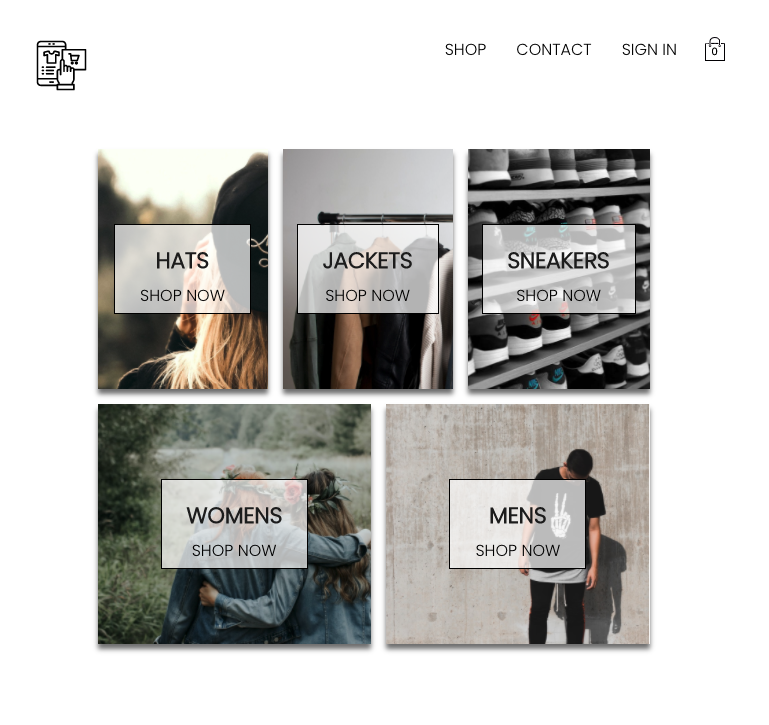

**AD Street Shop - [E-Commerce Shop]**

# 🏗  Refactored from JS to TypeScript
- Was originally in JavaScript but refactored/converted the whole project to TypeScript for practice purposes.

Full stack e-commerce online store application.

- Test Account
- Email: customer@test.com
- Password: test123

# Screen

# Technology Used

## Frontend

- TypeScript
- React
- Redux
- Stripe Integration
- Styled-Components
- Sass

## Backend

- Firebase authentication

## Setup

- yarn or npm install
- yarn or npm start

## Credit

- Icons made by Freepik from www.flaticon.com
- Free images from www.unsplash.com
